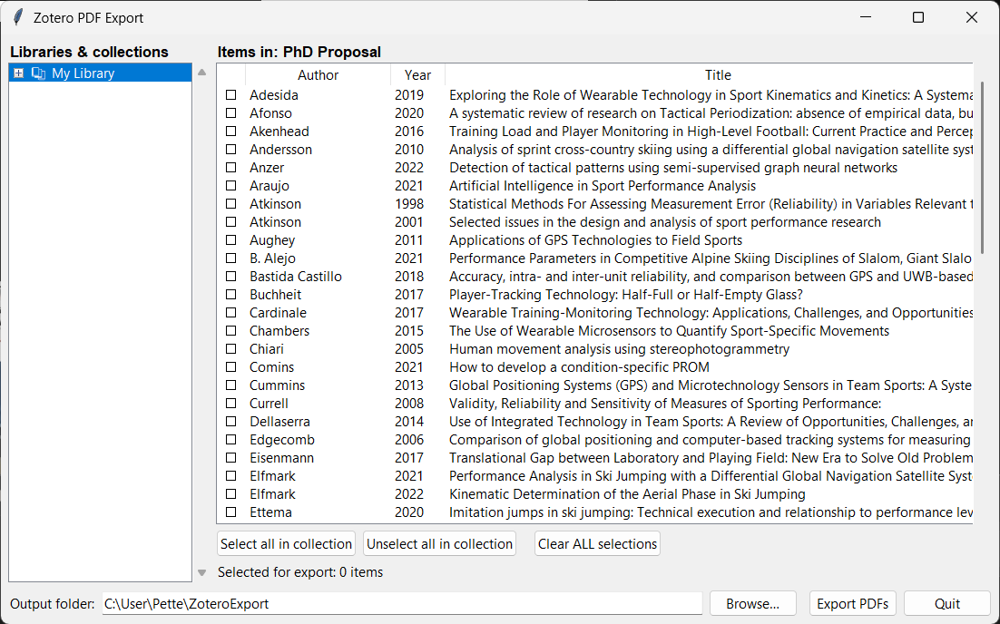

# Zotero PDF Export

> **A tiny GUI to bulk-export PDFs from your Zotero library into a flat folder, neatly named.**

Zotero stores attachments under opaque hashed folders like `storage/GJK3WNFX/some-paper.pdf`, with no built-in way to grab a curated set of PDFs into a single folder. This tool fixes that:

- Browse your **collections** in a familiar tree.
- **Tick the articles** you want — across as many collections as you like.
- Click **Export** and get a flat folder of `Author Year Title.pdf` files.

Handy for sharing reading lists, building literature-review folders, feeding the PDFs into another tool, or just rescuing them into a sane structure.

---

## ✨ Features

- 🖱️ **Point-and-click GUI** — no command line needed.
- 🗂️ **Pick whole collections or individual articles** — selections accumulate across collections.
- 🏷️ **Smart filenames** — `LastName YYYY Title.pdf`, sanitized for every filesystem.
- 🛟 **Safe with running Zotero** — works on a snapshot copy of your database, never touches the live file.
- 🪶 **Zero dependencies** — pure Python standard library (`tkinter` + `sqlite3`).
- 💻 **Cross-platform** — Windows, macOS, Linux.

---

## 🖼️ What it looks like



---

## 🚀 Quick start

### 1. Get the code

Either:

```bash
git clone https://github.com/PetterJolstad/zotero-pdf-export.git
cd zotero-pdf-export
```

…or just download the ZIP from GitHub and unzip it.

### 2. Make sure you have Python 3.10+

| OS      | Check                  | Get it from                                     |
|---------|------------------------|-------------------------------------------------|
| Windows | `py -3 --version`      | <https://www.python.org/downloads/>             |
| macOS   | `python3 --version`    | <https://www.python.org/downloads/> or `brew install python` |
| Linux   | `python3 --version`    | Your package manager (`apt install python3 python3-tk`)      |

> **Linux users:** Tkinter is sometimes split out — install `python3-tk` (Debian/Ubuntu) or `python3-tkinter` (Fedora) if you get an `import tkinter` error.

### 3. Run it

| OS            | How                                                   |
|---------------|-------------------------------------------------------|
| Windows       | Double-click `run.bat` — or `py -3 zotero_export.py`  |
| macOS / Linux | `./run.sh` (run `chmod +x run.sh` once first) — or `python3 zotero_export.py` |

The first time it launches it will auto-detect your Zotero data folder. If it can't find it, a folder picker opens — point it at the folder containing `zotero.sqlite` (in Zotero: **Settings → Advanced → Files and Folders**).

### 4. Export

1. Click a collection on the left.
2. Click items on the right to tick/untick them. (Selections persist when you switch collections.)
3. Pick an output folder at the bottom.
4. Click **Export PDFs**.

That's it — done.

---

## 🤔 How it works

- On startup, the script copies `zotero.sqlite` (and any `-journal` / `-wal` / `-shm` companion files) into a temp directory and reads from that copy. **Your real Zotero database is never opened for writing**, and the tool works whether Zotero is open or closed.
- The collections tree comes straight from your library; the items list shows author / year / title for everything in the selected collection.
- For each ticked item, the script finds its first PDF attachment (`itemAttachments.contentType = 'application/pdf'`), grabs the file from `storage/<hash>/<original-name>.pdf`, and copies it to your chosen folder as `LastName YYYY Title.pdf`.
- Items without a PDF attachment are skipped and listed in the final dialog.
- Filename collisions get `(2)`, `(3)`, … suffixes; titles are truncated and stripped of filesystem-illegal characters.

---

## 🛠️ Command-line options

```text
python zotero_export.py [--zotero-dir PATH]

  --zotero-dir PATH    Override the auto-detected Zotero data folder.
                       Useful if your library lives on an external drive.
```

Auto-detected locations (first match wins):

1. `~/Zotero` — modern default on all platforms
2. `~/Documents/Zotero` — common Windows alternative
3. `~/Library/Application Support/Zotero` — macOS legacy
4. `~/.zotero/zotero` — Linux legacy

---

## 🐞 Troubleshooting

| Problem                                     | Fix                                                                    |
|---------------------------------------------|------------------------------------------------------------------------|
| "No zotero.sqlite in …"                     | Pick the correct folder when prompted, or pass `--zotero-dir`.         |
| `ModuleNotFoundError: No module named 'tkinter'` (Linux) | `sudo apt install python3-tk` (or distro equivalent).      |
| GUI text looks blurry on Windows            | The script enables DPI-awareness automatically — try restarting it.    |
| Items show but a PDF is "skipped"           | That item has no PDF attachment in Zotero (maybe just a note/snapshot).|

---

## 🪪 License

MIT — see [LICENSE](LICENSE). Use it, fork it, ship it. Attribution appreciated but not required.

---

## 🤝 Contributing

Issues and PRs welcome. The whole thing is a single 300-line `zotero_export.py` — easy to read, easy to hack on.
